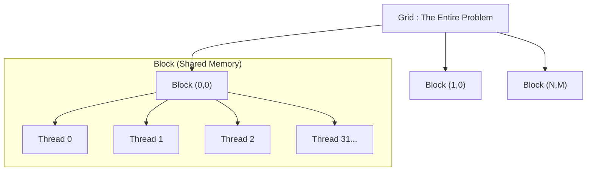

CUDA 프로그래밍을 시작할 때 가장 헷갈리는 부분이 바로 **소프트웨어(논리적) 개념**과 **하드웨어(물리적) 개념**의 매핑입니다.

"내가 작성한 Thread는 도대체 GPU의 어디에서 실행되는가?"
"Block 사이즈를 어떻게 잡아야 성능이 잘 나오는가?"

이 질문들에 답하기 위해서는 CUDA의 계층 구조를 명확히 이해해야 합니다. 이번 포스팅에서는 CUDA의 논리적 실행 단위인 Grid, Block, Thread와 실제 하드웨어 실행 단위인 SM, SP, Warp의 관계를 파헤쳐 봅니다.



### 1. 논리적 계층 구조 (Software View)

프로그래머가 코드를 작성할 때(Kernel Launch) 다루는 추상화된 계층입니다. 우리는 이 구조를 통해 병렬 작업을 정의합니다.

#### 계층 다이어그램



* **Thread (스레드):** 가장 작은 실행 단위입니다. 각 스레드는 고유한 ID(`threadIdx`)를 가지며, 할당된 레지스터를 사용해 연산을 수행합니다.
* **Block (블록):** 스레드들의 묶음입니다.
    * **중요 특징:** 같은 블록 내의 스레드들은 **Shared Memory(공유 메모리)**를 통해 데이터를 공유하고, `__syncthreads()`로 동기화할 수 있습니다.
    * 최대 스레드 개수: 보통 1024개 (하드웨어 버전에 따라 다름).
* **Grid (그리드):** 블록들의 묶음입니다. 커널(Kernel) 함수가 실행되는 전체 작업 영역을 의미합니다.

#### 코드에서의 표현
커널을 호출할 때 사용하는 `<<< >>>` 문법이 바로 이 구조를 정의합니다.

```cpp
// KernelCall <<< Grid Dimension, Block Dimension >>> (parameters...);
myKernel<<< 2, 128 >>>(devPtr);
```
위 코드는 *"128개의 스레드로 이루어진 블록을 2개 생성하라 (총 256개 스레드)"* 라는 의미입니다.

{:.centered width="500px"}

### 2. 물리적 하드웨어 구조 (Hardware View)

우리가 정의한 논리적 단위들은 실제 GPU 하드웨어에 매핑되어 실행됩니다. NVIDIA GPU 아키텍처의 핵심 구성 요소는 다음과 같습니다.

* **SP (Streaming Processor) / CUDA Core:**
    * 가장 기본이 되는 연산 유닛(ALU, FPU 등 포함)입니다.
    * 실제 명령어(Instruction)를 처리하는 주체입니다.
* **SM (Streaming Multiprocessor):**
    * 여러 개의 SP(CUDA Core)와 레지스터, 캐시(L1, Shared Memory), 스케줄러가 모여있는 큰 프로세서 코어입니다.
    * 독립적인 실행 단위로 볼 수 있습니다. (CPU의 코어와 유사한 개념)
* **Device (GPU):**
    * 여러 개의 SM이 모여 하나의 GPU를 구성합니다.

### 3. 핵심: 논리(SW)와 물리(HW)의 매핑

이 부분이 가장 중요합니다. 소프트웨어 개념이 하드웨어로 어떻게 연결되는지 아래 표로 정리했습니다.

| 구분 | 논리적 단위 (Software) | 물리적 단위 (Hardware) | 비고 |
|:---:|:---:|:---:|:---|
| **최소 단위** | Thread (스레드) | CUDA Core (SP) | 하나의 코어가 하나의 스레드 연산 담당 |
| **작업 그룹** | **Block (블록)** | **SM (Streaming Multiprocessor)** | **블록은 반드시 하나의 SM 안에서 실행됨** |
| **전체 작업** | Grid (그리드) | Device (GPU) | 여러 SM에 분산되어 실행 |

> **Key Insight:** 하나의 Block은 쪼개져서 여러 SM에 들어갈 수 **없습니다**. 반드시 하나의 SM에 통째로 할당됩니다. 반면, 하나의 SM은 자원이 허용하는 한 여러 개의 Block을 동시에 실행할 수 있습니다.

### 4. Warp: 논리와 물리를 잇는 다리

여기서 **Warp(워프)**라는 중요한 개념이 등장합니다. 프로그래머가 코드상으로 제어하는 단위는 아니지만, 하드웨어가 스레드를 실행하는 **실질적인 최소 단위**입니다.

#### Warp의 특징
1.  **32 Threads:** NVIDIA GPU에서 1 Warp는 항상 **32개의 스레드**로 구성됩니다.
2.  **SIMT (Single Instruction, Multiple Threads):**
    * 하나의 Warp 안에 있는 32개의 스레드는 **동일한 타이밍에 동일한 명령어**를 실행합니다.
    * 마치 군대에서 32명의 병사가 구령 하나에 맞춰 똑같이 움직이는 것과 같습니다.

#### Warp Divergence (워프의 분기)
Warp가 SIMT 구조이기 때문에 발생하는 성능 저하 문제입니다. 만약 32개의 스레드 중 16개는 `if`문을, 나머지 16개는 `else`문을 실행해야 한다면 어떻게 될까요?

```cpp
if (threadIdx.x < 16) {
    // A 작업
} else {
    // B 작업
}
```

* **현상:** 하드웨어는 'A 작업'을 할 때 `else`에 해당하는 스레드들을 **멈춰(Disable)** 둡니다. 반대로 'B 작업'을 할 때는 `if`에 해당하는 스레드들을 멈춥니다.
* **결과:** 결국 두 번 일하게 되어 성능이 절반으로 떨어집니다. 이를 **Warp Divergence**라고 합니다.

### 5. 마치며: 최적화를 위한 제언

CUDA 프로그래밍을 잘한다는 것은 결국 **이 하드웨어 구조에 맞게 코드를 짜는 것**입니다.

1.  **Block Size:** Warp가 32개 단위이므로, Block의 스레드 개수는 **32의 배수** (128, 256, 512 등)로 설정하는 것이 유리합니다.
2.  **Resource Usage:** 한 Block이 너무 많은 레지스터나 Shared Memory를 쓰면, SM이 동시에 실행할 수 있는 Block의 수(Occupancy)가 줄어듭니다.
3.  **Branching:** Warp 내에서 조건문 분기가 갈리지 않도록 알고리즘을 설계해야 합니다.

다음 포스팅에서는 실제 `Memory Hierarchy` (Global, Shared, Register)에 대해 자세히 다루어 보겠습니다.

---
**References:**
1. [NVIDIA CUDA Programming Guide - Advanced Kernel Programming](https://docs.nvidia.com/cuda/cuda-programming-guide/03-advanced/advanced-kernel-programming.html)
2. [CUDA Thread Hierarchy - Modal](https://modal.com/gpu-glossary/device-software/thread-hierarchy)
3. [Introduction to CUDA Programming - Read the Docs](https://cuda.readthedocs.io/ko/latest/CUDA_int/)


